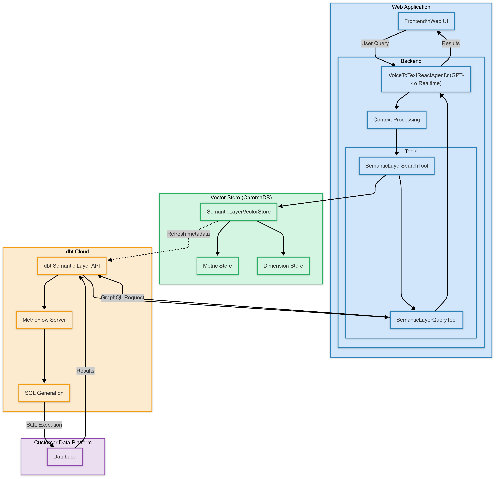

# Semantic Layer Assistant

A real-time voice and text interaction application that helps users analyze data using a semantic layer. This application enables natural language queries to explore metrics and dimensions, with support for both voice and text-based interactions.

https://www.loom.com/share/4804ce177dc24543858e4c5dfcd5600d?sid=b673ec1c-1c7d-4e6a-9d69-74ba4f5c49b5

## Features

- Natural language querying of semantic layer metrics and dimensions
- Real-time voice input processing using OpenAI's Real-time Voice API
- WebSocket-based real-time communication
- Vector store-based semantic search for metrics and dimensions
- Interactive data visualization with charts
- Conversation persistence and management
- Contextual querying with conversation-level filters and preferences
- Data refresh capabilities for real-time updates

## Architecture

The application consists of:
- `server/`: Python backend using Starlette, LangChain, and dbt Semantic Layer
- Vector store for efficient metric and dimension discovery
- WebSocket-based real-time communication layer
- Chart visualization using Chart.js
- SQLite-based conversation and message storage



## Prerequisites

- Python 3.12+
- OpenAI API key with access to voice models
- dbt semantic layer environment and credentials

## Setup

1. Copy the `.env.example` file to `.env` in the server directory and update with your credentials:

```bash
cp .env.example .env
```

The `.env` file should contain:

```bash
OPENAI_API_KEY=your_api_key_here
SL__HOST=your_semantic_layer_host
SL__ENVIRONMENT_ID=your_environment_id
SL__TOKEN=your_semantic_layer_token
```

2. [Optional] Install dependencies:

Create a virtual environment:

```
uv venv
```

Include the development dependencies:
```
uv sync --all-extras
```

Or, install the dependencies without the development dependencies:

```
uv sync
```

## Running the Application

1. Start the backend server:
```bash
uv run src/server/app.py
```

2. Open your browser to `http://localhost:3000`

## Development

### Backend Components

The backend is built using:
- Starlette for the web server
- LangChain for AI agent and tool execution
- dbt Semantic Layer for data access
- Chroma for vector storage
- WebSockets for real-time communication
- SQLite for conversation storage

Key files:
- `server/src/langchain_openai_voice/__init__.py`: Core voice agent implementation
- `server/src/server/app.py`: Starlette server implementation
- `server/src/server/tools.py`: Semantic layer tool implementations
- `server/src/server/vectorstore.py`: Vector store for metric/dimension discovery
- `server/src/server/storage.py`: Conversation and message persistence
- `server/src/server/chart_models.py`: Chart generation and configuration
- `server/src/server/prompt.py`: Example queries and agent instructions

### Conversation Context

The application supports setting conversation-level context that persists across all queries within a conversation. This allows users to:

- Set default filters (e.g., "Filter all results to 2023")
- Specify default ordering (e.g., "Always order in ascending")
- Filter by specific dimensions (e.g., "Only include the Automobile market segment")
- Require specific metrics in all queries (e.g., "Always include revenue and profit")

This context is intelligently applied to every query in the conversation, removing the need to repeatedly specify the same filters or preferences.

### Query Examples

The system supports natural language queries like:
- "Show me total revenue"
- "What was our monthly revenue and profit for 2023?"
- "Who are our top 10 salespeople by revenue?"
- "Show me revenue by region for US customers"
- "What's our daily revenue trend for the past 30 days?"

With context applied, simple queries automatically inherit the context settings:
- Context: "Filter to Q4-2023" + Query: "Show me revenue" = Revenue filtered to Q4 2023
- Context: "Only US customers" + Query: "Top regions by profit" = Top US regions by profit

## Contributing

Contributions are welcome! Please feel free to submit a Pull Request. For major changes, please open an issue first to discuss what you would like to change.

Please make sure to update tests as appropriate.

### Development Process

1. Fork the repository
2. Create your feature branch (`git checkout -b feature/AmazingFeature`)
3. Commit your changes (`git commit -m 'Add some AmazingFeature'`)
4. Push to the branch (`git push origin feature/AmazingFeature`)
5. Open a Pull Request

## Acknowledgments

This project was built upon the [LangChain React Voice Agent](https://github.com/langchain-ai/react-voice-agent) repository, which provides the foundation for creating ReAct-style agents using OpenAI's Realtime API.

## License

This project is licensed under the MIT License - see below for details:
